  

---

## 🧑‍💻 Sobre mí / About Me

* 💼 **Profesión:** Desarrollador de software con especial interés en el backend y la arquitectura de sistemas. 
  💼 **Profession:** Software developer with a strong interest in backend and system architecture.

* 🌱 **Actualmente aprendiendo:** Mejorando mis habilidades en C y C++, profundizando en algoritmos y estructuras de datos, dominando Makefiles, debugging con Valgrind y afianzando mi manejo del terminal y herramientas Linux gracias al Common Core de 42. 
  🌱 **Currently learning:** Improving my C and C++ skills, diving deeper into algorithms and data structures, mastering Makefiles, debugging with Valgrind, and strengthening my command of the terminal and Linux tools thanks to the 42 common core.

* 🎯 **Objetivo:** Aprender todo lo posible y seguir mejorando cada día dentro de este apasionante mundo de la informática. 
  🎯 **Goal:** To learn as much as possible and keep growing every day within this fascinating world of computer science.

* ⚡ **Dato curioso:** Soy un friki entusiasta, especialmente de los videojuegos. ¡Me encantaría algún día participar en el desarrollo de uno! 
  ⚡ **Fun fact:** I'm a passionate geek, especially about video games. I'd love to take part in developing one someday!

---

## 🛠️ Tecnologías & Herramientas / Technologies & Tools

  
  
  
  
  
  
  
  
  

---

## 📊 Estadísticas de GitHub / GitHub Stats

  
  
  

  

---

## 🏆 GitHub Trophies

  

---

## 💻 Lenguajes & Herramientas / Languages & Tools

  
  
  
  

---

## 📈 Actividad reciente / Recent Activity

<!--RECENT_ACTIVITY:start-->
1. ⬆️ Pushed undefined commit(s) to [rmunoz-c/rmunoz-c](https://github.com/rmunoz-c/rmunoz-c) 
2. ⬆️ Pushed undefined commit(s) to [rmunoz-c/rmunoz-c](https://github.com/rmunoz-c/rmunoz-c) 
3. ⬆️ Pushed undefined commit(s) to [rmunoz-c/Exam05](https://github.com/rmunoz-c/Exam05) 
4. ⬆️ Pushed undefined commit(s) to [rmunoz-c/Exam05](https://github.com/rmunoz-c/Exam05) 
5. ⭐ Starred [Univers42/Examen42](https://github.com/Univers42/Examen42) 
<!--RECENT_ACTIVITY:end-->

---

## 📫 Contacto / Contact

  
  

---

  

---

  ✨ ¡Gracias por visitar mi perfil! / Thanks for visiting my profile! ✨

